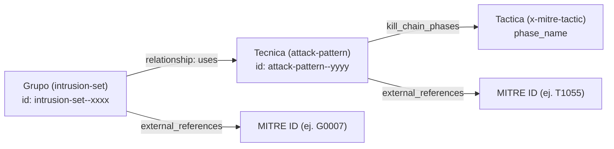

# MaTTrix

CLI en Rust para consultar información de la matriz MITRE ATT&CK (Enterprise) directamente desde la terminal: grupos de amenazas (APT), técnicas, tácticas y las relaciones entre ellos, a partir de los datos oficiales publicados por MITRE en formato STIX.

## Requisitos

- Rust y Cargo (vía [rustup](https://rustup.rs/)).
- `curl`.

## Instalación

### 1. Clonar el repositorio

```bash
git clone https://github.com/<usuario>/mattrix.git
cd mattrix
```

### 2. Descargar los datos de MITRE ATT&CK

El programa no incluye los datos de MITRE; se leen en tiempo de ejecución desde un archivo local. Es necesario descargarlos una vez antes de usar el CLI:

```bash
mkdir -p ~/.mitre
curl -L "https://raw.githubusercontent.com/mitre-attack/attack-stix-data/master/enterprise-attack/enterprise-attack.json" > ~/.mitre/matrix.json
```

Este comando descarga el bundle STIX de la matriz Enterprise de ATT&CK y lo guarda en `~/.mitre/matrix.json`, la ruta donde el CLI espera encontrarlo. Para mantener los datos actualizados basta con volver a ejecutar este mismo comando; sobrescribe el archivo anterior.

### 3. Compilar el binario

```bash
cargo build --release
```

El binario resultante queda en `target/release/mattrix`. Para poder ejecutarlo como `mattrix` desde cualquier ubicación, instálalo en el `PATH` de Cargo:

```bash
cargo install --path .
```

## Uso

El CLI expone varios subcomandos. La sintaxis general es:

```bash
mattrix <comando> [argumentos]
```

| Comando | Ejemplo | Descripción |
|---|---|---|
| `apt-list` | `mattrix apt-list` | Lista todos los grupos APT disponibles en los datos. |
| `apt <nombre>` | `mattrix apt APT28` | Consulta un grupo por nombre o alias (búsqueda parcial, sin distinguir mayúsculas). Muestra nombre, ID de MITRE, alias, descripción, técnicas utilizadas agrupadas por táctica, total de técnicas y referencias externas. |
| `tid <id>` | `mattrix tid T1055` | Consulta una técnica por su ID de MITRE. Muestra nombre, descripción, tácticas asociadas, plataformas y los grupos que la utilizan. |
| `tn <texto>` | `mattrix tn "process injection"` | Busca técnicas cuyo nombre contiene el texto indicado; puede haber más de un resultado. |
| `tac <nombre>` | `mattrix tac persistence` | Consulta una táctica y muestra las técnicas asociadas a ella. |

## Funcionamiento interno

El programa sigue un flujo lineal en cada ejecución: carga el archivo de datos local, interpreta el comando solicitado, filtra los objetos correspondientes dentro de esos datos y presenta el resultado por terminal.




Los datos descargados desde MITRE siguen el formato STIX 2.x: un único archivo JSON con una lista plana de objetos de distintos tipos (grupo, técnica, táctica, relación, entre otros). El CLI no reorganiza estos datos en una base de datos ni los indexa; en cada consulta recorre la lista completa filtrando por tipo de objeto y por los criterios de búsqueda indicados. Las relaciones entre un grupo y las técnicas que utiliza no están dentro del propio objeto del grupo ni de la técnica, sino en objetos independientes de tipo `relationship`, que el programa cruza en tiempo de consulta:


## Roadmap

- Interfaz TUI.
- Modo de salida `--json` en el CLI para facilitar la integración con otras herramientas.

## Licencia

Este proyecto está licenciado bajo la licencia MIT. Ver el archivo `LICENSE` para más detalle.
